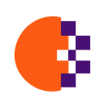
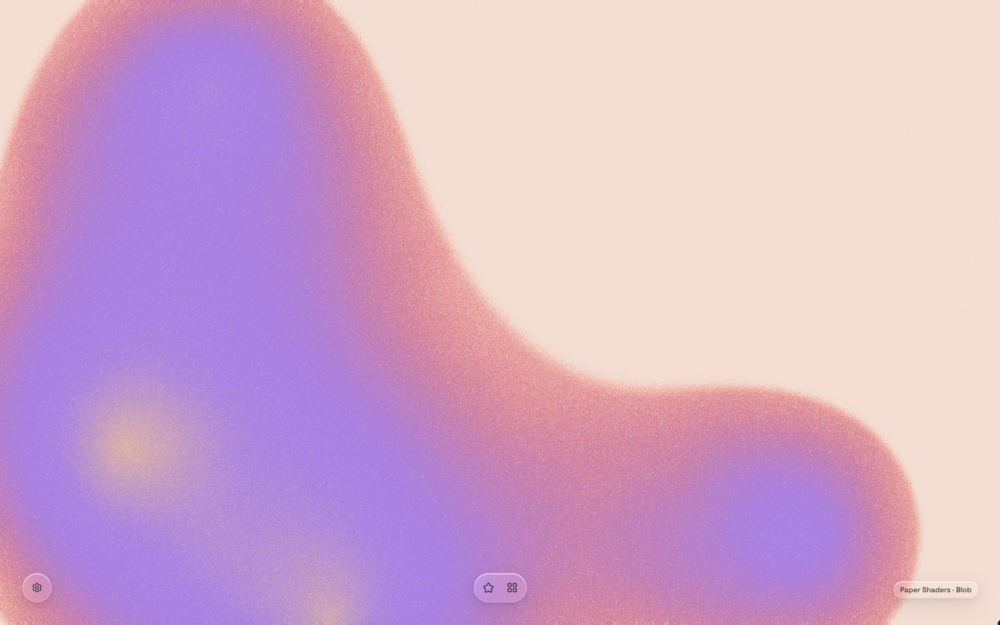
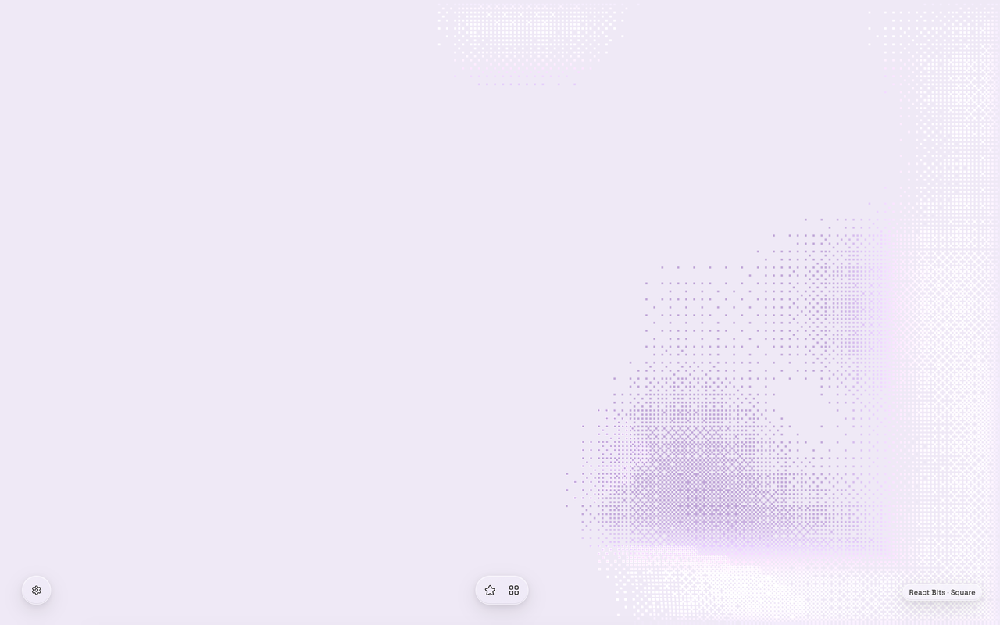
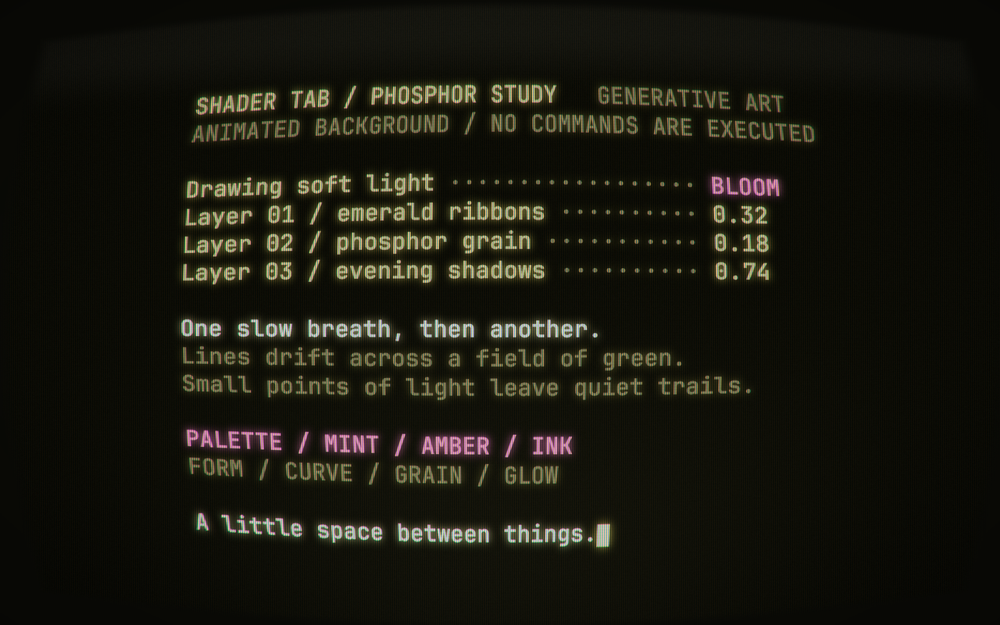

<div align="center">
  
  <h1>Shader Tab</h1>
  <p><strong>A little room to breathe, every new tab.</strong></p>
  <p>Slow-moving shaders. Quiet glass controls. Your favorite places within reach.</p>
  <p>
    <a href="https://shadertab.simonwong.cn/en/">Website & live demo</a> ·
    <a href="README.zh-CN.md">简体中文</a> ·
    <a href="docs/development.md">Development</a> ·
    <a href="https://github.com/simonwong/shader-tab/issues">Feedback</a>
  </p>
  <p><strong>6 background families · 53 variants · 8 languages</strong></p>
</div>



Shader Tab replaces Chrome’s new tab page with animated backgrounds and local bookmark navigation. Move your pointer and the controls appear. Step away and they fade, leaving space for the background.

## A calmer start

- **Motion that takes its time.** Breathing-paced animation, light and dark themes, and gentle pointer interactions.
- **A different view each time.** Choose the background families in your random pool. Variants shuffle without repeats within each family’s cycle; the current tab keeps its view.
- **Your bookmarks, close by.** Browse and search Chrome’s bookmark folders, pin up to 10 favorites, and drag to reorder them. Icons use Chrome’s existing favicon cache.
- **Controls on your terms.** Show or hide favorites and bookmark navigation independently. Choose sorting and how quickly idle controls disappear.
- **Considered rendering.** Drivers load on demand. Hidden tabs stop rendering and release their GPU context after 30 seconds. Reduced-motion settings use static backgrounds.
- **Eight languages.** English, 简体中文, 繁體中文, 日本語, 한국어, Français, Deutsch, and Español. Follow your browser’s language or choose one in Settings.

## Pick a mood

<table>
  <tr>
    <td width="50%"></td>
    <td width="50%"></td>
  </tr>
  <tr>
    <td align="center">Pixel Blast</td>
    <td align="center">CRT Terminal</td>
  </tr>
</table>

| Background | Character | Built with |
| --- | --- | --- |
| Grain Gradient | Soft color fields and fine grain | Paper Shaders |
| Dithering | Patterned gradients and retro texture | Paper Shaders |
| Pixel Blast | Interactive pixels and ripples | React Bits / Three.js |
| Predictive Arc | Arcs, particles, ribbons, and fields | ThreeUI |
| CRT | Phosphor glow and decorative screens | ThreeUI |
| Shader Gradient | Plane, Sphere, and Water forms | Shader Gradient |

These are actual extension screenshots. Explore the motion on the [live demo](https://shadertab.simonwong.cn/en/#effects), or see the [full variant list](docs/effect-variants.md).

## Get Shader Tab

[**Install from the Chrome Web Store**](https://chromewebstore.google.com/detail/shader-tab/behmbnoomagbbcdpmgpmabdaeajifhej)

Once installed, open a new tab. Move your pointer to reveal the controls: Settings in the lower-left corner, favorites and bookmark folders at the bottom center, and the current background’s source at the lower right.

| Shortcut | Action |
| --- | --- |
| `Tab` | Reveal and navigate controls |
| `Escape` | Close the current panel |
| `⌘ ,` / `Ctrl ,` | Open Settings |

## Your data stays in your browser

The extension has no accounts, ads, or analytics. It reads Chrome bookmarks locally and never edits the original bookmark tree. Favorites and preferences stay in `chrome.storage.local`; the extension does not sync them across devices or upload bookmark data.

| Permission | Purpose |
| --- | --- |
| `bookmarks` | Read the bookmark tree and keep navigation in sync |
| `storage` | Save favorites, preferences, and shuffle state locally |
| `favicon` | Display cached icons for visible bookmarks |

No host permissions, content scripts, or remote executable code. Scripts, shaders, and fonts ship with the extension.

**Uninstalling clears the extension’s favorites and settings, but not your Chrome bookmarks.** When updating an unpacked development installation, keep the same folder and reload it instead of uninstalling.

[Privacy policy](https://shadertab.simonwong.cn/locales/en/privacy) · [Third-party notices](https://shadertab.simonwong.cn/locales/en/licenses)

## Build locally

Requires **Node.js 22.12+** and **pnpm 10**.

```sh
git clone https://github.com/simonwong/shader-tab.git
cd shader-tab
pnpm install
pnpm dev
```

For a production build and validation:

```sh
pnpm check
pnpm zip
```

Load `.output/chrome-mv3` through **Load unpacked** at `chrome://extensions`. ZIP packages are generated in `.output/`.

Built with **WXT, React, TypeScript, Three.js, Radix UI, and Hugeicons**. The [development guide](docs/development.md) covers extension debugging, website deployment, and verification commands.

## Inside the project

| Guide | Contents |
| --- | --- |
| [Development](docs/development.md) | Local setup, build outputs, website, and QA |
| [Architecture](docs/architecture.md) | Data boundaries, storage, and rendering lifecycle |
| [Backgrounds](docs/shaders.md) | Shader integrations and sources |
| [Variants](docs/effect-variants.md) | All 53 combinations and shuffle behavior |
| [Performance](docs/performance.md) | Rendering budgets and measurement results |

Technical reference documents are currently in Chinese.

## Credits & licensing

Shader Tab uses work from [Paper Shaders](https://github.com/paper-design/shaders), [React Bits](https://github.com/DavidHDev/react-bits), [ThreeUI](https://github.com/MengTo/threeui), and [Shader Gradient](https://github.com/ruucm/shadergradient), alongside [Hugeicons](https://github.com/hugeicons/hugeicons) and Space Grotesk.

Third-party code and assets retain their respective licenses. In particular, the bundled React Bits code includes additional restrictions; do not assume every file in this repository is MIT-licensed. See the [license review](docs/shader-license-review.md) and [license texts](public/licenses/).

Found a bug or have an idea? [Open an issue](https://github.com/simonwong/shader-tab/issues). For private support, contact [support@simonwong.cn](mailto:support@simonwong.cn).
